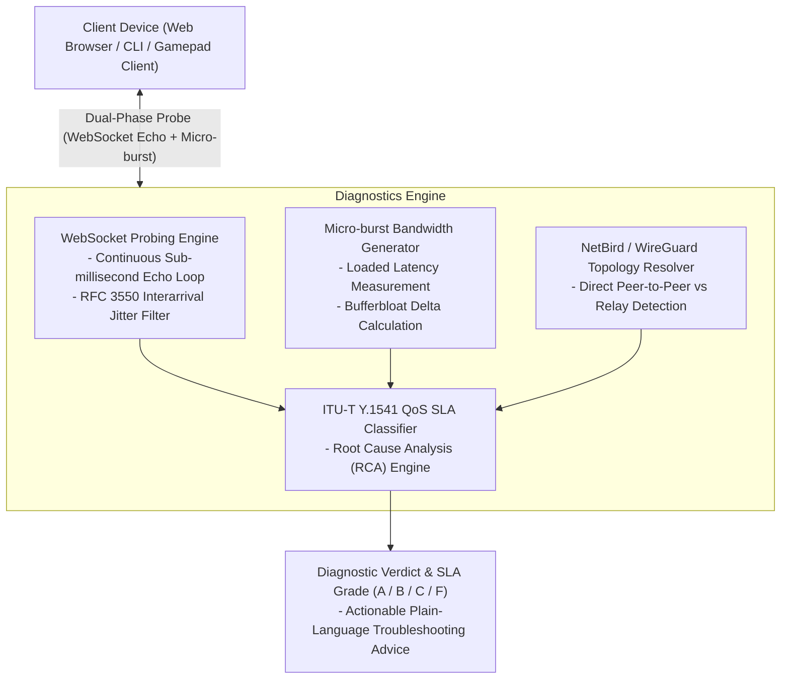

# stream-netcheck

[](https://www.python.org/)
[](https://fastapi.tiangolo.com/)
[](https://www.docker.com/)
[](https://datatracker.ietf.org/doc/html/rfc3550)
[](LICENSE)

Real-time network Quality of Service (QoS), bufferbloat, and mesh overlay diagnostic engine designed specifically for low-latency interactive streaming (Moonlight, Sunshine, GeForce NOW) and remote virtual workspaces.

---

## The Problem: Why Standard Speedtests Fail for Cloud Gaming

Traditional speedtests measure bulk TCP download speeds against public CDN edge servers. For real-time interactive game streaming, bandwidth is rarely the bottleneck; rather, stream quality is dictated by transport-layer stability:

1. **Idle vs. Loaded Latency (Bufferbloat):** A home connection may demonstrate 15 ms latency when idle. Under a 40 Mbps video stream, unmanaged consumer router queues fill up, causing latency to spike to 200+ ms.
2. **Interarrival Jitter (RFC 3550):** Video decoders and packet buffers can handle a steady 40 ms ping, but erratic delay swings (10 ms -> 90 ms -> 15 ms) cause immediate frame drops, stuttering, and audio desynchronization.
3. **Overlay Mesh Routing (WireGuard / NetBird):** When clients connect through software-defined mesh overlays, symmetric NATs can prevent direct peer-to-peer UDP hole punching. Traffic silently falls back to intermediate cloud relay nodes (TURN/DERP), introducing unexpected latency penalties without user awareness.

`stream-netcheck` resolves these visibility gaps by executing multi-phase telemetry, isolating root causes, and categorizing performance according to international telecommunications standards.

---

## Architectural Topology



---

## Mathematical Models & Standards

### 1. Interarrival Jitter (RFC 3550)
Rather than relying on simple standard deviation, `stream-netcheck` calculates interarrival jitter using the continuous smoothing filter specified in RFC 3550 for RTP streams:

If $S_i$ is the send timestamp of packet $i$ and $R_i$ is the receive timestamp, the packet transit difference between consecutive packets is defined as:

$$D(i-1, i) = (R_i - S_i) - (R_{i-1} - S_{i-1})$$

The cumulative smoothed jitter $J$ is updated incrementally:

$$J_i = J_{i-1} + \frac{|D(i-1, i)| - J_{i-1}}{16}$$

### 2. Bufferbloat Delta ($\Delta_{\text{bufferbloat}}$)
The bufferbloat index quantifies queue delay induced when the network interface is saturated:

$$\Delta_{\text{bufferbloat}} = \text{RTT}_{\text{loaded}} - \text{RTT}_{\text{idle}}$$

- $\Delta < 15 \text{ ms}$: Excellent buffer management.
- $15 \le \Delta < 40 \text{ ms}$: Moderate queue growth.
- $\Delta \ge 40 \text{ ms}$: Severe bufferbloat; router queue starvation.

### 3. ITU-T Y.1541 QoS SLA Tiers

| SLA Grade | Service Tier | Average RTT | RFC 3550 Jitter | Packet Loss | Bufferbloat Delta | Mesh Route |
| :--- | :--- | :--- | :--- | :--- | :--- | :--- |
| **Grade A** | Optimal (4K @ 60 FPS) | $< 25 \text{ ms}$ | $< 3.5 \text{ ms}$ | $0.0\%$ | $< 20 \text{ ms}$ | Direct P2P |
| **Grade B** | Good (1080p @ 60 FPS) | $< 45 \text{ ms}$ | $< 8.0 \text{ ms}$ | $\le 0.5\%$ | $< 50 \text{ ms}$ | Direct P2P |
| **Grade C** | Playable (720p / RPG) | $< 75 \text{ ms}$ | $< 15.0 \text{ ms}$ | $\le 2.0\%$ | Arbitrary | Direct P2P |
| **Grade F** | Degraded / Unstable | $\ge 75 \text{ ms}$ | $\ge 15.0 \text{ ms}$ | $> 2.0\%$ | $\ge 50 \text{ ms}$ | Relayed / Dropping |

---

## Deployment & Quick Start

### 1. Standalone Docker Deployment
Run the pre-configured container exposing port `8055`:

```bash
docker run -d \
  --name stream-netcheck \
  -p 8055:8055 \
  --restart unless-stopped \
  mateosek/stream-netcheck:latest
```

Alternatively, build and run via Docker Compose:
```bash
docker compose up -d
```

Access the diagnostic dashboard at `http://localhost:8055`.

### 2. Manual Python Setup
```bash
git clone https://github.com/Mateosek/stream-netcheck.git
cd stream-netcheck

pip install -r requirements.txt
uvicorn server.app:app --host 0.0.0.0 --port 8055
```

### 3. Headless CLI Client
To execute network quality checks from a terminal or automation pipeline:

```bash
python -m cli.main --host 127.0.0.1:8055 --count 30
```

To export structured telemetry for CI/CD or logging:
```bash
python -m cli.main --host 127.0.0.1:8055 --json
```

---

## Ecosystem Integration (Twierdza Cloud Gaming)

`stream-netcheck` was developed as the diagnostic telemetry backbone for the [Twierdza Cloud Gaming Platform](https://github.com/Mateosek/twierdza-cloud-gaming). 

Its zero-dependency frontend can be embedded into central management dashboards via an iframe or direct web component:

```html
<iframe 
  src="http://twierdza-host:8055" 
  width="100%" 
  height="650px" 
  frameborder="0">
</iframe>
```

---

## Author & License

Developed and maintained by Mateusz Malinowski ([@Mateosek](https://github.com/Mateosek)).  
Distributed under the terms of the [MIT License](LICENSE).
