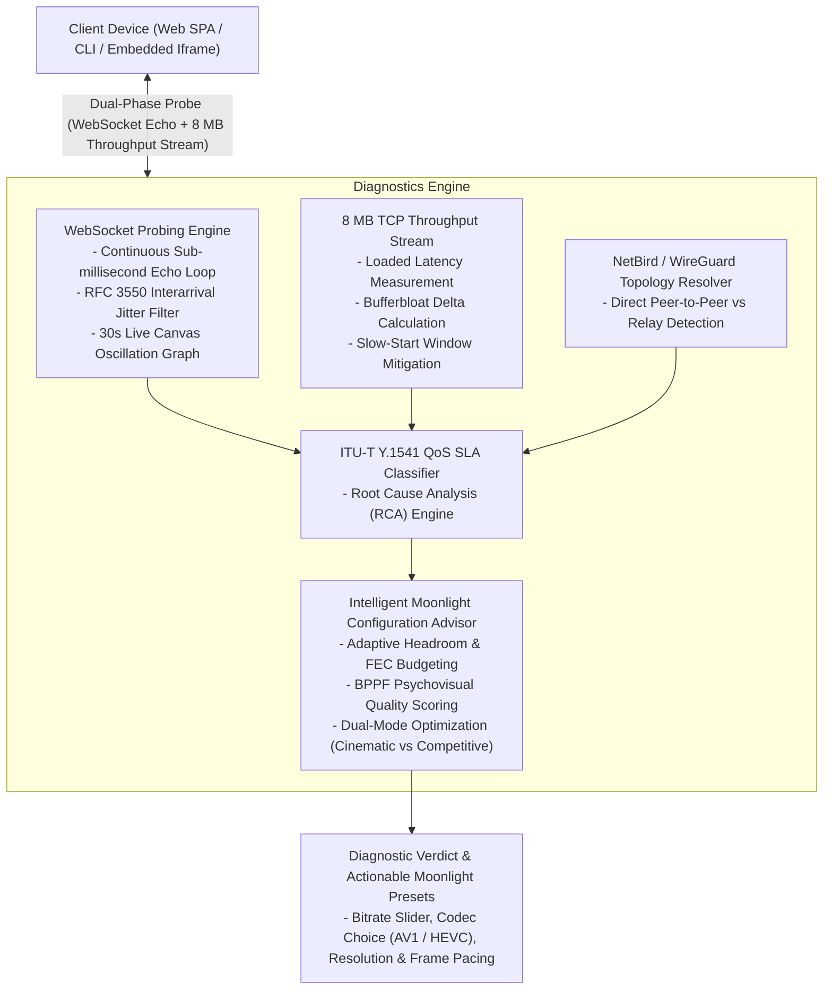

# stream-netcheck

[](https://www.python.org/)
[](https://fastapi.tiangolo.com/)
[](https://www.docker.com/)
[](https://datatracker.ietf.org/doc/html/rfc3550)
[](LICENSE)

Real-time network Quality of Service (QoS), bufferbloat, and mesh overlay diagnostic engine designed specifically for low-latency interactive game streaming (**Moonlight**, **Sunshine**, **GeForce NOW**) and remote virtual workspaces.

Featuring an **Intelligent Moonlight Configuration Advisor** with psychovisual Bits-Per-Pixel-Per-Frame ($BPPF_{\text{eff}}$) scoring, adaptive bandwidth headroom, and Forward Error Correction (FEC) budgeting.

---

## The Problem: Why Standard Speedtests Fail for Cloud Gaming

Traditional speedtests measure bulk TCP download speeds against public CDN edge servers. For real-time interactive game streaming, bandwidth is rarely the bottleneck; rather, stream quality is dictated by transport-layer stability and encoding limits:

1. **Idle vs. Loaded Latency (Bufferbloat):** A home connection may demonstrate 15 ms latency when idle. Under a 40 Mbps video stream, unmanaged consumer router FIFO queues fill up, causing latency to spike to 200+ ms and dropping real-time frame deadlines.
2. **Interarrival Jitter (RFC 3550):** Video decoders and packet buffers can handle a steady 40 ms ping, but erratic delay swings (10 ms -> 90 ms -> 15 ms) cause immediate frame drops, stuttering, and audio desynchronization.
3. **The 4K Bitrate Trap & Scene Entropy Bursts:** Pushing 4K @ 60 FPS on a 65 Mbps connection with an 80 Mbps Moonlight preset causes immediate collapse. Constant Bitrate (CBR) encoders spike 30–50% during high-entropy scene changes (fast camera turns, grass, explosions). Without safety headroom, intermediate network buffers overflow.
4. **Overlay Mesh Routing (WireGuard / NetBird):** When clients connect through software-defined mesh overlays, symmetric NATs can prevent direct peer-to-peer UDP hole punching. Traffic silently falls back to intermediate cloud relay nodes (TURN/DERP), introducing unexpected latency penalties without user awareness.

`stream-netcheck` resolves these visibility gaps by executing multi-phase telemetry, isolating root causes, and synthesizing precise, actionable Moonlight/Sunshine client configurations.

---

## Architectural Topology



---

## Intelligent Moonlight / Sunshine Configuration Advisor

Rather than presenting raw network telemetry that requires specialized interpretation, `stream-netcheck` translates physical network parameters into **exact, optimal settings for Moonlight and Sunshine**.

### 1. Adaptive Video Bitrate Budgeting

Sunshine video streams share the underlying transport link with **Forward Error Correction (FEC)** packets. The advisor calculates the maximum safe video bitrate $\text{Bitrate}_{\text{safe}}$ using:

$$\text{Bitrate}_{\text{raw}} = (\text{Throughput} \times \text{Headroom}) \times \text{Factor}_{\text{fec}} \times \text{Penalty}_{\text{loss}} \times \text{Penalty}_{\text{bloat}}$$

$$\text{Bitrate}_{\text{safe}} = \max\left(3.0\text{ Mbps}, \max\left(\text{Throughput} \times 0.25, \text{Bitrate}_{\text{raw}}\right)\right)$$

* **Adaptive Headroom:**
  * $\Delta \text{ Bufferbloat} \le 3.0\text{ ms} \rightarrow 0.80$
  * $3.0\text{ ms} < \Delta \text{ Bufferbloat} \le 12.0\text{ ms} \rightarrow 0.70$
  * $\Delta \text{ Bufferbloat} > 12.0\text{ ms} \rightarrow 0.60$
* **FEC Overhead Factor:**
  * $\text{Packet Loss} < 0.2\% \rightarrow \text{FEC} = 0\%$ ($\text{Factor}_{\text{fec}} = 1.0$)
  * $0.2\% \le \text{Packet Loss} \le 1.0\% \rightarrow \text{FEC} = 10\%$ ($\text{Factor}_{\text{fec}} \approx 0.909$)
  * $\text{Packet Loss} > 1.0\% \rightarrow \text{FEC} = 20\%$ ($\text{Factor}_{\text{fec}} \approx 0.833$)
* **Penalties:**
  * $\text{Penalty}_{\text{loss}} = 0.85$ if $\text{Packet Loss} > 1.0\%$
  * $\text{Penalty}_{\text{bloat}} = 0.90$ if $\Delta \text{ Bufferbloat} > 35.0\text{ ms}$

### 2. Psychovisual Quality Scoring ($BPPF_{\text{eff}}$)

To prevent visual degradation caused by excessive compression, candidate profiles are evaluated using **Effective Bits Per Pixel Per Frame ($BPPF_{\text{eff}}$)**:

$$BPPF_{\text{raw}} = \frac{\text{Bitrate}_{\text{safe}} \times 10^6}{\text{Width} \times \text{Height} \times \text{FPS}}$$

$$BPPF_{\text{eff}} = BPPF_{\text{raw}} \times \text{Codec Multiplier} \quad (\text{AV1}: 1.70, \text{ HEVC}: 1.45, \text{ H.264}: 1.00)$$

* **Hard Floor:** Any candidate with $BPPF_{\text{eff}} < 0.10$ is disqualified.
* **Resolution Component:** $\text{Score}_{\text{res}} = \frac{\text{Height}}{2160.0}$
* **Quality Saturation:** $\text{Score}_{\text{quality}} = \min\left(1.0, \max\left(0.0, \frac{BPPF_{\text{eff}} - 0.10}{0.25}\right)\right)$

### 3. Dual-Mode Profile Selection

* **Cinematic Mode ($\text{FPS} \le 60$):** Focuses on visual fidelity and detail retention in motion:
  $$\text{Score}_{\text{cinematic}} = 0.35 \times \text{Score}_{\text{res}} + 0.65 \times \text{Score}_{\text{quality}}$$
* **Competitive Mode ($\text{FPS} == 120$):** Prioritizes frame rate and motion clarity. Strictly enabled only when $\text{RTT} \le 30.0\text{ ms}$:
  $$\text{Score}_{\text{competitive}} = 0.25 \times \text{Score}_{\text{res}} + 0.75 \times \text{Score}_{\text{quality}}$$

#### Why 1440p AV1 Beats 4K at 65 Mbps:
On a **65 Mbps** link with $+4.2\text{ ms}$ bloat, the safe bitrate is **45 Mbps**:
* **4K @ 60 FPS (AV1):** $BPPF_{\text{eff}} = 0.154 \rightarrow \text{Score} = 0.489$ (heavy compression artifacts in motion).
* **1440p @ 60 FPS (AV1):** $BPPF_{\text{eff}} = 0.346 \rightarrow \mathbf{\text{Score} = 0.873}$ (triumph: over $2.2\times$ the bit density, producing razor-sharp textures).

---

## Dual Testing Modes

1. **Quick Test (~4 seconds):** 30 high-frequency ICMP/WebSocket probes ($50\text{ ms}$ interval) followed by an 8 MB throughput burst. Ideal for rapid verification before launching a session.
2. **Full Stability Monitor (30 seconds):** 180 continuous probes ($150\text{ ms}$ interval) with a **real-time Canvas RTT oscillation graph**. Specifically detects periodic Wi-Fi frame drops, 802.11 MAC retransmissions, background channel sweeps, and modulation rate throttling.

### 8 MB TCP Slow-Start Optimization
Throughput probing utilizes an **8 MB binary stream** (`/api/bandwidth/chunk?size_mb=8.0`). On connections with 25–40 ms RTT, smaller chunks (e.g. 2 MB) complete before the TCP Congestion Window (cwnd) fully opens, artificially deflating bandwidth estimates. An 8 MB payload ensures accurate link saturation.

---

## Mathematical Models & Standards

### 1. Interarrival Jitter (RFC 3550)
Calculated using the exponential smoothing filter specified in RFC 3550 for RTP streams:

$$D(i-1, i) = (R_i - S_i) - (R_{i-1} - S_{i-1})$$

$$J_i = J_{i-1} + \frac{|D(i-1, i)| - J_{i-1}}{16}$$

### 2. Bufferbloat Delta ($\Delta_{\text{bufferbloat}}$)
Quantifies buffer queuing delay induced under network load:

$$\Delta_{\text{bufferbloat}} = \text{RTT}_{\text{loaded}} - \text{RTT}_{\text{idle}}$$

### 3. ITU-T Y.1541 QoS SLA Tiers

| SLA Grade | Designation | Average RTT | RFC 3550 Jitter | Packet Loss | Bufferbloat Delta | Overlay Route |
| :--- | :--- | :--- | :--- | :--- | :--- | :--- |
| **Grade A** | Ultra-Low Latency | $\le 25 \text{ ms}$ | $\le 3.5 \text{ ms}$ | $0.0\%$ | $\le 15 \text{ ms}$ | Direct P2P |
| **Grade B** | Stable Interactive | $\le 45 \text{ ms}$ | $\le 6.0 \text{ ms}$ | $\le 0.5\%$ | $\le 30 \text{ ms}$ | Direct P2P |
| **Grade C** | Functional / High Latency | $> 45 \text{ ms}$ | $\le 12.0 \text{ ms}$ | $\le 2.5\%$ | $\le 60 \text{ ms}$ | Direct P2P |
| **Grade D** | Degraded / Relayed | $> 75 \text{ ms}$ | $> 12.0 \text{ ms}$ | $> 2.5\%$ | $> 60 \text{ ms}$ | Relayed (TURN) |

---

## Deployment & Quick Start

### 1. Standalone Docker Deployment
Run the pre-configured container exposing port `8055`:

```bash
docker run -d \
  --name stream-netcheck \
  -p 8055:8055 \
  --restart unless-stopped \
  mateosek/stream-netcheck:latest
```

Alternatively, build and run via Docker Compose:
```bash
docker compose up -d
```

Access the web interface at `http://localhost:8055`.

### 2. Manual Python Setup
```bash
git clone https://github.com/Mateosek/stream-netcheck.git
cd stream-netcheck

pip install -r requirements.txt
python -m uvicorn server.app:app --host 0.0.0.0 --port 8055
```

### 3. Headless CLI Client
Execute network quality checks with complete Moonlight preset output from a terminal:

```bash
python -m cli.main --host 127.0.0.1:8055 --count 30
```

To export structured telemetry (including `moonlight_config`) for automated pipelines:
```bash
python -m cli.main --host 127.0.0.1:8055 --json
```

---

## Test Suite Verification

`stream-netcheck` includes an exhaustive automated test suite covering RFC 3550 jitter filters, bufferbloat edge-cases, Wi-Fi spike detection, and all 5 reference Moonlight advisor scenarios:

```bash
pytest -v
```

```text
tests/test_advisor.py::test_scenario_a_baseline PASSED                   [  8%]
tests/test_advisor.py::test_scenario_b_fiber PASSED                      [ 16%]
tests/test_advisor.py::test_scenario_c_degradation PASSED                [ 25%]
tests/test_advisor.py::test_scenario_d_narrow_band PASSED                [ 33%]
tests/test_advisor.py::test_scenario_e_distant_p2p PASSED                [ 41%]
tests/test_qos.py::test_rfc3550_jitter_zero_variance PASSED              [ 50%]
tests/test_qos.py::test_rfc3550_jitter_varying_delay PASSED              [ 58%]
tests/test_qos.py::test_qos_metrics_aggregation PASSED                   [ 66%]
tests/test_qos.py::test_sla_grade_a PASSED                               [ 75%]
tests/test_qos.py::test_sla_grade_f_due_to_relay PASSED                  [ 83%]
tests/test_qos.py::test_sla_bufferbloat_detection PASSED                 [ 91%]
tests/test_qos.py::test_sla_wifi_spike_detection PASSED                  [100%]
============================== 12 passed in 0.03s ==============================
```

---

## Ecosystem Integration (Twierdza Cloud Gaming)

`stream-netcheck` was developed as the diagnostic telemetry backbone for the [Twierdza Cloud Gaming Platform](https://github.com/Mateosek/twierdza-cloud-gaming). 

Its zero-dependency frontend can be embedded into central management dashboards via an iframe:

```html
<iframe 
  src="http://twierdza-host:8055" 
  width="100%" 
  height="620px" 
  frameborder="0">
</iframe>
```

---

## Author & License

Developed and maintained by Mateusz Malinowski ([@Mateosek](https://github.com/Mateosek)).  
Distributed under the terms of the [MIT License](LICENSE).
